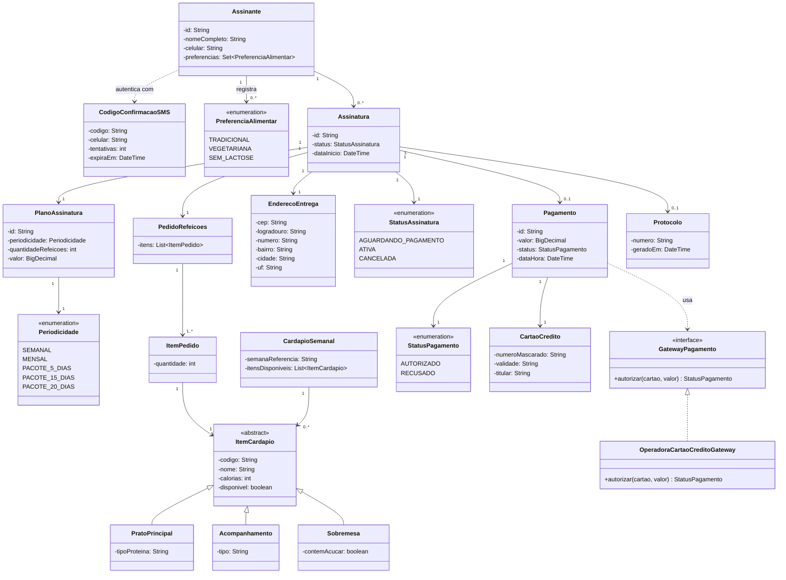

# Diagrama de Classes de Domínio

## Relacionamentos principais

- Um **Assinante** pode ter várias **Assinaturas** ao longo do tempo, e registra suas **PreferenciaAlimentar**.
- Cada **Assinatura** agrega um **PlanoAssinatura**, um **PedidoRefeicoes**, um **EnderecoEntrega**, e opcionalmente um **Pagamento** e um **Protocolo**.
- **ItemCardapio** é uma superclasse abstrata especializada em **PratoPrincipal**, **Acompanhamento** e **Sobremesa**; o **CardapioSemanal** reúne os itens disponíveis na semana.
- **PedidoRefeicoes** é composto por **ItemPedido**, cada um referenciando um **ItemCardapio** com sua quantidade.
- **Pagamento** depende da interface **GatewayPagamento** (implementada por **OperadoraCartaoCreditoGateway**) em vez de depender diretamente da operadora — isso garante baixo acoplamento entre o domínio e o sistema externo.
